# Hackathon 2021

This was created as part of Microsoft's [2021 Hackathon](https://garagehackbox.azurewebsites.net/hackathons/2356/projects/105003).

See a video of it in action to the right. 

## Parts List

Parts are chosen to be plug and play, with no soldering required. This build uses the [Qwiic](https://www.sparkfun.com/qwiic) I2C wiring system to be very easy to piece together.

Sensors can be left off if uninterested in their measurements.

| Part | Description | Sparkfun Link | Adafruit Link
| ---- | ----------- | ------------- | -------------
| Raspberry Pi 4 Model B 2GB | Main board. | [SF Pi 4](https://www.sparkfun.com/products/15446) | [AF Pi 4](https://www.adafruit.com/product/4292)
| Sensirion SCD40 | CO2, Relative Humidity, and Temperature sensor. | [SF SCD40](https://www.sparkfun.com/products/18365) | [AF SCD40](https://www.adafruit.com/product/5187)
| TE MS5637 | Barometric Pressure and Temperature sensor. Used to calibrate the SDC40. | [SF MS5637](https://www.sparkfun.com/products/14688)
| Sensirion SGP40 | VOC change sensor. | [SF SGP40](https://www.sparkfun.com/products/18345) | [AF SGP40](https://www.adafruit.com/product/4829)
| Sensirion SPS30 | PM0.5, PM1.0, PM2.5, PM4, and PM10 sensor. | [SF SPS30](https://www.sparkfun.com/products/15103)
| [Waveshare 2.9" E-ink](https://www.waveshare.com/product/displays/e-paper/epaper-2/2.9inch-e-paper-module.htm) | A display to show measurements.

### Addressable RGB

To wire the LEDs, some breadboarding or soldering will be required.

Other than the LEDs themselves, these parts do not require software support. Feel free to mix and match.

| Part | Description | Mouser Link | Adafruit Link
| ---- | ----------- | ------------- | -------------
| SK9822 / APA102C | Addressable RGB LEDs. | [SF APA102C](https://www.sparkfun.com/products/14015) | [AF SK9822](https://www.adafruit.com/product/2239?length=1)
| 3.3v to 5v level shifter, min two inputs | Converts signals from Pi's 3.3v to the LED's 5v. | [Mouser SN74AHCT125N](https://www.mouser.com/ProductDetail/595-SN74AHCT125N) | [AF SN74AHCT125N](https://www.adafruit.com/product/1787)
| Capacitor, min 5V 1000μF | To smooth out power demand of LEDs. | [Mouser ESW108M6R3AH1AA](https://www.mouser.com/ProductDetail/80-ESW108M6R3AH1AA)

## Operating System Setup

Before wiring everything up, lets setup the software.

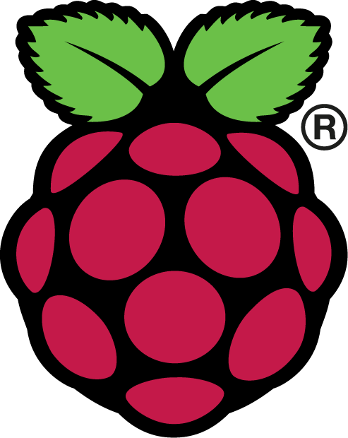

1. <a href="https://www.raspberrypi.com/software/">Flash Raspberry Pi OS to a MicroSD card</a>.

I recommend using the Lite (32-bit) image, though the full Desktop image will work as well.
 

2. Enable I2C and SPI.

Each GPIO on the Raspberry Pi can have many different functions. We need to enable the I2C1, SPI0, and SPI1 interfaces.

Open config.txt file from the boot partition of the MicroSD card, and find this section of the file:

<pre># Uncomment some or all of these to enable the optional hardware interfaces
#dtparam=i2c_arm=on
#dtparam=i2s=on
#dtparam=spi=on</pre>

And change that section to look like:

<pre># Uncomment some or all of these to enable the optional hardware interfaces
dtparam=i2c_arm=on
#dtparam=i2s=on
dtparam=spi=on

dtoverlay=spi1-1cs,cs0_pin=23</pre>

 

3. Configure SSH.

To run headless and/or allow you to login to your Pi via SSH, create an empty file with the name "ssh" in the same directory as config.txt.
 

4. Configure WiFi (Optional).

If you want to connect to the Pi via WiFi, configure it now by adding a file wpa_supplicant.conf to the same directory as config.txt:

<pre>country=US
ctrl_interface=DIR=/var/run/wpa_supplicant GROUP=netdev
update_config=1

network={
ssid="your ssid"
psk="your psk"
key_mgmt=WPA-PSK
}</pre> 

## Wiring Instructions

If this is your first time putting together an IoT project with a Raspberry Pi, take some time to get familiar with its GPIO pins:

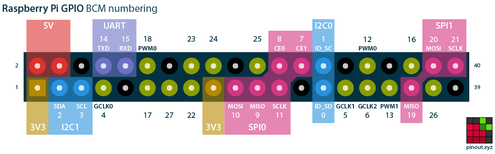

It's not as intimidating as it looks, but please take it easy. It's very possible you'll fry your hardware if you hook things up incorrectly.

 The Hackathon 2021 build makes use of large number of these pins, such as:

- 3V3, 5V, and Ground (the black pins), to power things.
- I2C1, to connect Qwiic devices.
- SPI0, to connect the screen.
- SPI1, to connect addressable RGB LEDs.
- Several of the digital pins.

Lets wire things up step by step. You'll want to have several Qwiic cables and some jumper cables available.

### SCD40

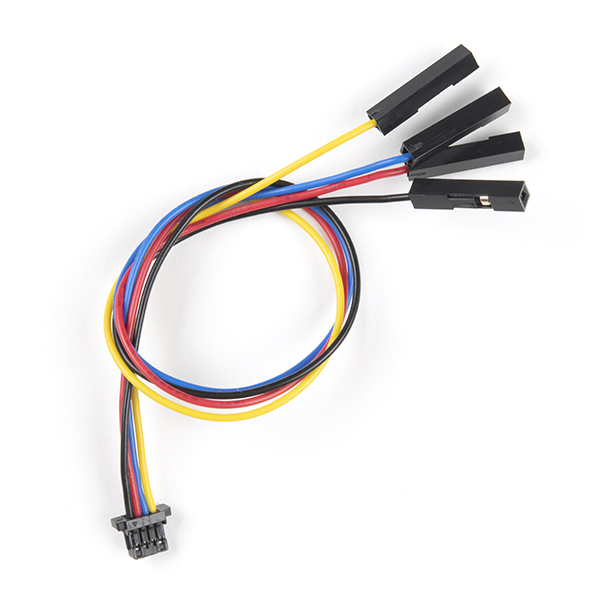

1. Grab a Qwiic to Female Jumper cable. The SCD40 runs over I2C, and will be connected to I2C1, 3V3, and Ground.

Proceed to the next step to plug it in.
 

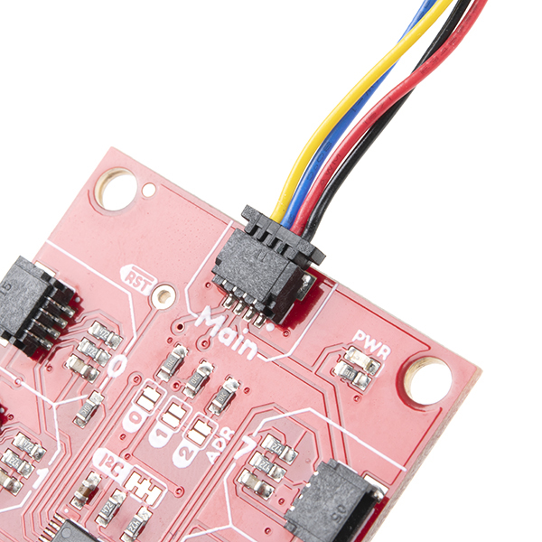

2. Connect the JST end of the Qwiic cable to the SCD40.
 

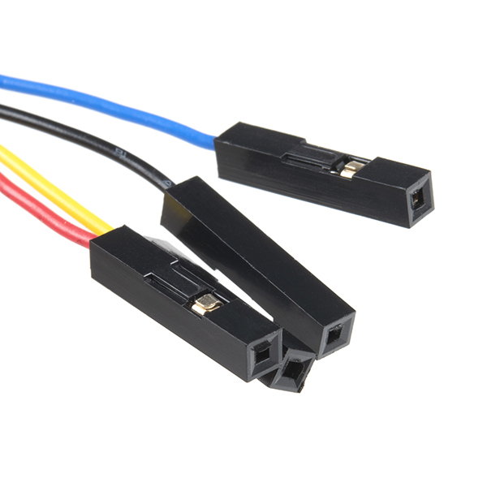

3. Connect the female jumper end of the Qwiic cable to the Raspberry Pi.

The wire is color coded to know which hookup to make:

<ul style="overflow: hidden">
<li>Black = GND (any)</li>
<li>Red = 3V3 (any)</li>
<li>Blue = I2C1 SDA</li>
<li>Yellow = I2C1 SCL</li>
</ul> 

### MS5637

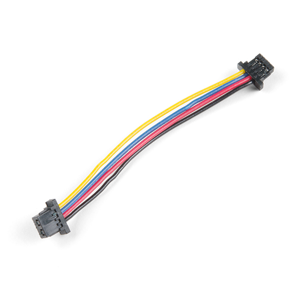

4. Time to connect your MS5637. Now grab a Qwiic JST-to-JST cable.

Proceed to the next step to plug it in.
 

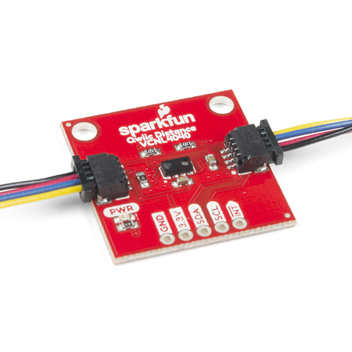

5. Plug one end of the cable into the remaining empty JST header on the SCD40.
 

6. Connect the other end of the cable into the MS5637.

Qwiic is designed to be easily chained together, and it doesn't matter which device is connected first or last.
 

### SGP40

7. Repeat the MS5637 instructions, this time chaining the MS5637 to the SGP40. 

### SPS30

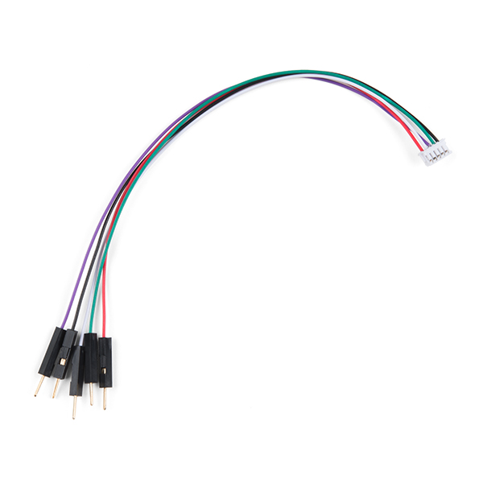

8. Grab the SPS30 cable.

On one side, you have a JST ZHR-5 connector that goes into the SPS30. On the other side are male jumper pins.
 

9. Grab a Qwiic to Female Jumper cable. Connect three of the female jumpers to the SPS30 cable.

The wire is color coded to know which hookup to make:

<ul style="overflow: hidden">
<li>Black (Qwiic cable) = Black (SPS30 cable)</li>
<li>Blue (Qwiic cable) = White (SPS30 cable)</li>
<li>Yellow (Qwiic cable) = Purple (SPS30 cable)</li>
</ul> 

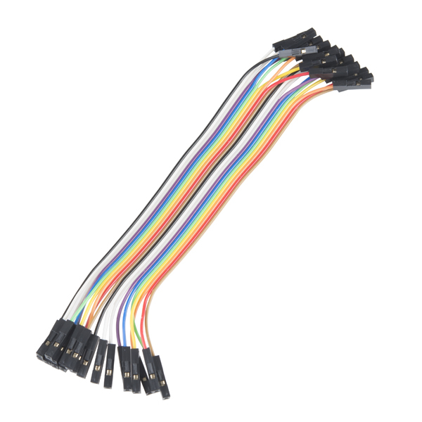

10. Grab two short Female to Female Jumper cables.

These will be used to connect the remaining two SPS30 wires to the Raspberry Pi. The wire is color coded to know which hookup to make.

<ul style="overflow: hidden">
<li>Red = 5V (any)</li>
<li>Green = GND (any)</li>
</ul> 

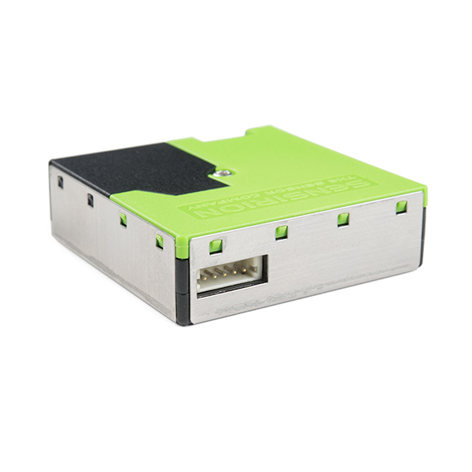

11. Connect the JST ZHR-5 connector from your SPS30 cable to the header on the SPS30.

If the connector seems loose, it may not be plugged in all the way.
 

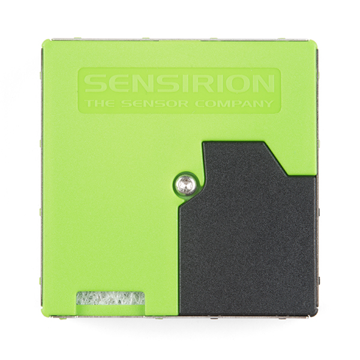

When mounting the SPS30, take care to give the intake (with its fibrous filter) good access to air.
 

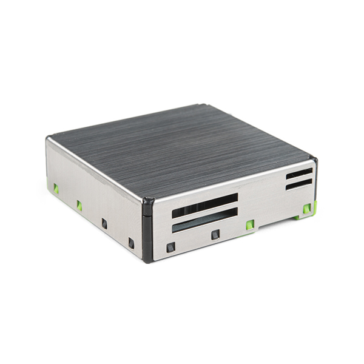

When mounting the SPS30, take care to give four outtake holes good access to air.

<b>Important:</b> The metal sides of the SPS30 are connected to ground. Be sure it is not touching any conductors, or a short circuit may destroy your devices.
 

### 2.9" E-Paper Display

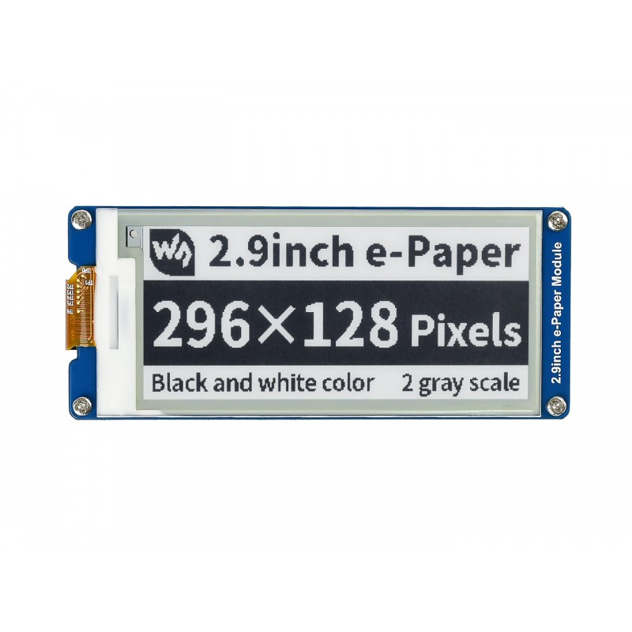

12. Lets install the 2.9" E-Paper Display. 

Observe the ordering of the pins on the rear left header of the 2.9" E-Paper Display:
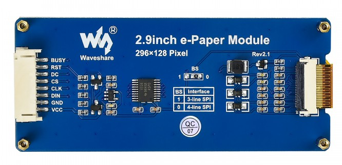 

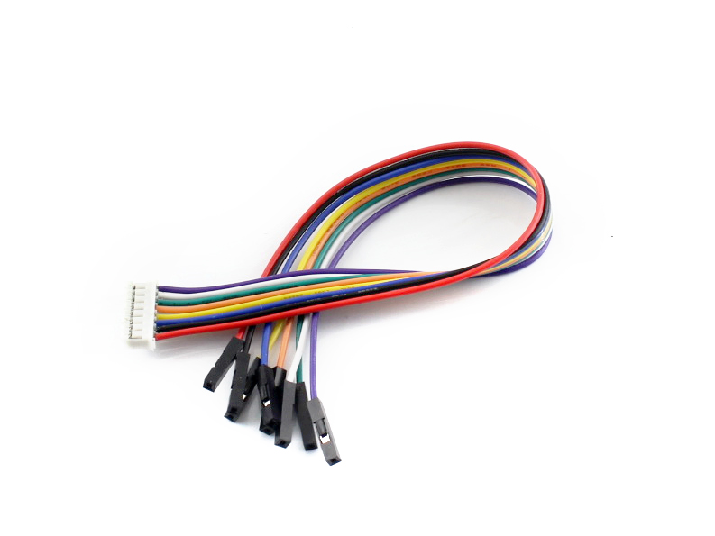

13. Grab the SPS30 cable.

Connect the cable to the 2.9" E-Paper Display module. Connect the other end to the Raspberry Pi. The wire is color coded to know which hookup to make, but double check with the labels on the back in case they change the colors:

<ul style="overflow: hidden">
<li>VCC = 5V (any)</li>
<li>GND = GND (any)</li>
<li>DIN = SPI0 MOSI</li>
<li>CLK = SPI0 SCK</li>
<li>CS = CE0</li>
<li>DC = 25</li>
<li>RST = 17</li>
<li>BUSY = 24</li>
</ul> 

### LEDs

To connect LEDs, soldering a protoboard is recommended. A breadboard may not be able to handle the power requirements.

TODO

## Aether Software Setup

1. Connect to your Raspberry Pi.

If you're running headless, SSH into the Pi remotely. Otherwise, connect a screen/keyboard, login, and open a terminal.

The default username and password for a Raspberry Pi are "pi" and "raspberry".
 

2. Install .NET 6

Follow the <a href="https://docs.microsoft.com/en-us/dotnet/core/install/linux-scripted-manual#scripted-install">.NET 6 Install instructions</a>.
 

3. Clone Aether

<pre>git clone https://github.com/scalablecory/aether.git
cd aether/src/Aether</pre> 

4. Edit Program.cs

Modify the main command handler based on the hardware you installed. You may need to tweak pin numbers if you didn't wire things exactly the same, or set a different pixel count if you installed addressable RGB.

TODO: replace this step with modifying a config file?
 

5. Run Aether

<pre>dotnet run -c Release -- run-device</pre> 

## Copyright Notice

Images &copy; their respective owners. Images &copy; SparkFun are [CC BY 2.0](https://creativecommons.org/licenses/by/2.0/).